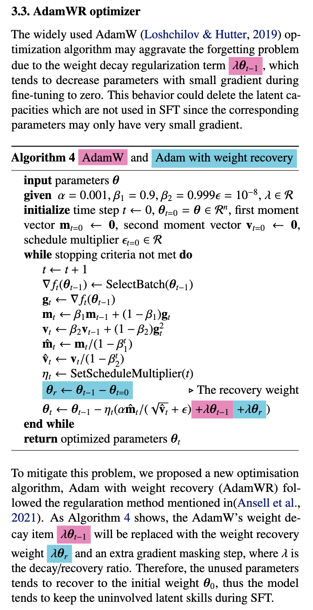

# AdamWR
The Adam with Weight Recovery optimizer

## TL;DR
AdamW tends to decay parameters towards zero, which makes the model "forget" the pretrained parameters during finetuning. Instead, AdamWR tries to recover parameters towards pretrained values during finetuning.

## Have a try
Just like other PyTorch optimizers,

 ``` pyhon
from adamwr import AdamWR
from xxx import SomeModel, SomeData, SomeDevice, SomeLoss

model = SomeModel()
dataloader = SomeData()
model.to(SomeDevice)

adamwr = AdamWR(
    model.parameters(),
    lr=1e-5,
    betas=(0.9, 0.998), # Adam's beta parameters
    eps=1e-8,
    weight_recovery=0.1
    )

loss_fn = SomeLoss()

for x, y in dataloader:
    adamwr.zero_grad()
    y_bar = model(x)
    loss = loss_fn(y_bar, y)
    loss.backward()
    optimizer.step()
 ```

 ## Algorithm
 TODO: improve the readability
 Here is a paper snippet:
